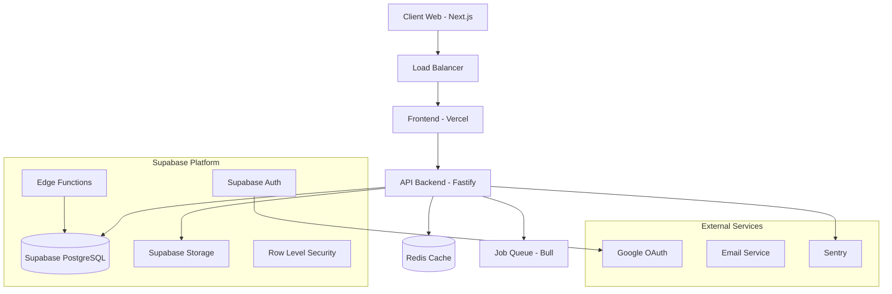
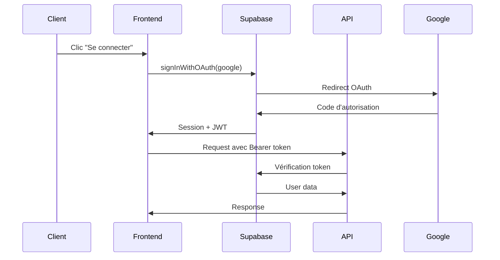
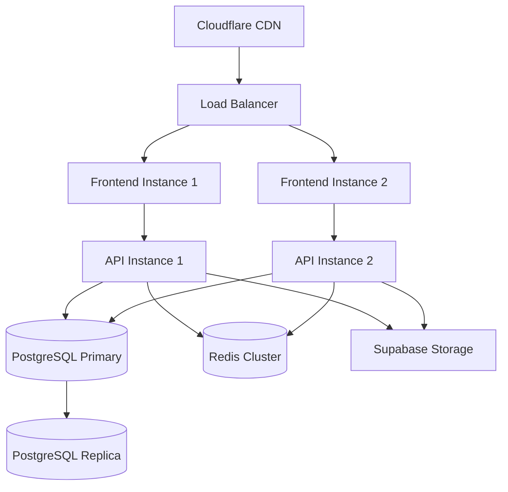

# Architecture Technique - Business Plan Generator

## Vue d'ensemble de l'architecture



## Architecture Frontend (Next.js)

### Structure des dossiers

```
frontend/
├── src/
│   ├── app/                    # App Router (Next.js 14)
│   │   ├── (auth)/            # Route groups pour auth
│   │   ├── dashboard/         # Pages principales
│   │   ├── projects/          # Gestion des projets
│   │   │   ├── [id]/         # Pages dynamiques
│   │   │   └── new/          # Création projet
│   │   └── layout.tsx        # Layout principal
│   ├── components/           # Composants React
│   │   ├── ui/              # shadcn/ui components
│   │   ├── forms/           # Formulaires métier
│   │   ├── tables/          # Tableaux financiers
│   │   ├── charts/          # Graphiques
│   │   └── layouts/         # Layouts spécialisés
│   ├── lib/                 # Utilitaires
│   │   ├── supabase/        # Configuration Supabase
│   │   ├── stores/          # Zustand stores
│   │   ├── hooks/           # Custom hooks
│   │   └── utils.ts         # Fonctions utilitaires
│   ├── types/               # Types TypeScript
│   └── styles/              # Styles globaux
├── public/                  # Assets statiques
└── middleware.ts           # Middleware Next.js
```

### État de l'application (Zustand)

```typescript
// stores/project-store.ts
interface ProjectStore {
  // État
  currentProject: Project | null
  financialData: FinancialOutput[]
  calculationStatus: 'idle' | 'calculating' | 'completed' | 'error'

  // Actions
  setCurrentProject: (project: Project) => void
  updateFinancialData: (data: FinancialOutput[]) => void
  triggerCalculation: (projectId: string) => Promise<void>
  exportProject: (format: string, theme: string) => Promise<string>
}
```

### Composants clés

#### ProjectWorkbook (Interface type Excel)
```typescript
interface ProjectWorkbookProps {
  projectId: string
  readonly?: boolean
}

const ProjectWorkbook: FC<ProjectWorkbookProps> = ({ projectId, readonly }) => {
  const tabs = [
    { id: 'overview', label: 'Synoptique', component: OverviewTab },
    { id: 'products', label: 'Produits/Services', component: ProductsTab },
    { id: 'sales', label: 'Ventes', component: SalesTab },
    { id: 'capex', label: 'CAPEX', component: CapexTab },
    { id: 'opex', label: 'OPEX', component: OpexTab },
    { id: 'payroll', label: 'Paie', component: PayrollTab },
    { id: 'financing', label: 'Financement', component: FinancingTab },
    { id: 'assumptions', label: 'Hypothèses', component: AssumptionsTab },
    { id: 'results', label: 'Résultats', component: ResultsTab },
    { id: 'scenarios', label: 'Scénarios', component: ScenariosTab }
  ]

  return (
    <div className="h-screen flex flex-col">
      <TabNavigation tabs={tabs} />
      <TabContent />
      <StatusBar />
    </div>
  )
}
```

#### FinancialTable (Tableaux dynamiques)
```typescript
interface FinancialTableProps {
  data: FinancialOutput[]
  columns: ColumnDef[]
  editable?: boolean
  onCellChange?: (rowId: string, field: string, value: any) => void
}
```

### Gestion des données (React Query)

```typescript
// hooks/use-financial-data.ts
export function useFinancialData(projectId: string, scenarioId?: string) {
  return useQuery({
    queryKey: ['financial-data', projectId, scenarioId],
    queryFn: () => fetchFinancialData(projectId, scenarioId),
    staleTime: 5 * 60 * 1000, // 5 minutes
    refetchInterval: false
  })
}

export function useCalculateProjection() {
  const queryClient = useQueryClient()

  return useMutation({
    mutationFn: triggerCalculation,
    onSuccess: (data, variables) => {
      queryClient.invalidateQueries(['financial-data', variables.projectId])
    }
  })
}
```

## Architecture Backend (Fastify)

### Structure des dossiers

```
backend/
├── src/
│   ├── index.ts             # Point d'entrée
│   ├── routes/              # Routes API
│   │   ├── projects.ts      # CRUD projets
│   │   ├── calculations.ts  # Calculs financiers
│   │   ├── imports.ts       # Import de données
│   │   ├── exports.ts       # Génération exports
│   │   └── metrics.ts       # Métriques et analyses
│   ├── services/            # Services métier
│   │   ├── supabase.ts      # Client Supabase
│   │   ├── financial.ts     # Logique financière
│   │   ├── import.ts        # Traitement imports
│   │   └── export.ts        # Génération exports
│   ├── calculations/        # Moteur de calcul
│   │   ├── financial.ts     # Calculs financiers
│   │   ├── ratios.ts        # Ratios bancaires
│   │   └── scenarios.ts     # Gestion scénarios
│   ├── utils/               # Utilitaires
│   │   ├── validation.ts    # Validation Zod
│   │   ├── formatting.ts    # Formatage données
│   │   └── errors.ts        # Gestion d'erreurs
│   └── types/               # Types partagés
├── tests/                   # Tests unitaires
└── docs/                    # Documentation API
```

### Plugin Fastify structure

```typescript
// index.ts
async function buildApp() {
  const fastify = Fastify({
    logger: { level: process.env.NODE_ENV === 'development' ? 'info' : 'warn' }
  })

  // Configuration
  await fastify.register(env, { schema: envSchema })
  await fastify.register(cors, { origin: getAllowedOrigins() })
  await fastify.register(multipart, { limits: { fileSize: 10 * 1024 * 1024 } })
  await fastify.register(jwt, { secret: fastify.config.JWT_SECRET })

  // Routes
  await fastify.register(projectRoutes, { prefix: '/api/projects' })
  await fastify.register(calculationRoutes, { prefix: '/api/calculations' })
  await fastify.register(importRoutes, { prefix: '/api/imports' })
  await fastify.register(exportRoutes, { prefix: '/api/exports' })
  await fastify.register(metricsRoutes, { prefix: '/api/metrics' })

  return fastify
}
```

### Moteur de calcul financier

```typescript
// calculations/financial.ts
export class FinancialCalculator {
  private project: Project
  private assumptions: Assumptions
  private taxSettings: TaxSettings
  private workingCapital: WorkingCapital

  async calculateMonthlyProjections(
    products: ProductService[],
    salesProjections: SalesProjection[],
    capex: Capex[],
    opex: Opex[],
    payrollRoles: PayrollRole[],
    headcountPlan: HeadcountPlan[],
    loans: Loan[],
    scenarioId?: string
  ): Promise<FinancialOutput[]> {
    const results: FinancialOutput[] = []
    const horizonMonths = this.project.horizon_years * 12

    for (let month = 0; month < horizonMonths; month++) {
      const monthlyResult = await this.calculateMonth(month, {
        products,
        salesProjections,
        capex,
        opex,
        payrollRoles,
        headcountPlan,
        loans
      })

      results.push(monthlyResult)
    }

    return results
  }

  private async calculateMonth(month: number, data: any): Promise<FinancialOutput> {
    // Calculs mensuels détaillés
    const revenue = this.calculateMonthlyRevenue(month, data)
    const cogs = this.calculateMonthlyCogs(month, data)
    const opex = this.calculateMonthlyOpex(month, data)
    const depreciation = this.calculateDepreciation(month, data)
    const interest = this.calculateInterest(month, data)
    const taxes = this.calculateTaxes(month, data)

    // Construction du résultat
    return {
      // ... calculs détaillés
    }
  }
}
```

## Architecture Base de Données (Supabase)

### Modèle de données principal

```sql
-- Tables principales avec relations
projects
├── organizations (many-to-one)
├── products_services (one-to-many)
├── sales_projections (one-to-many)
├── capex (one-to-many)
├── opex (one-to-many)
├── payroll_roles (one-to-many)
├── loans (one-to-many)
├── financial_outputs (one-to-many)
├── scenarios (one-to-many)
└── project_collaborators (many-to-many avec users)
```

### Row Level Security (RLS)

```sql
-- Politique RLS pour les projets
CREATE POLICY "project_access" ON projects
FOR ALL USING (
  -- Créateur du projet
  created_by = auth.uid()
  OR
  -- Collaborateur du projet
  id IN (
    SELECT project_id FROM project_collaborators
    WHERE user_id = auth.uid()
  )
);

-- Politique RLS héritée pour les données financières
CREATE POLICY "financial_data_access" ON financial_outputs
FOR ALL USING (
  project_id IN (
    SELECT id FROM projects
    WHERE created_by = auth.uid()
    OR id IN (
      SELECT project_id FROM project_collaborators
      WHERE user_id = auth.uid()
    )
  )
);
```

### Index de performance

```sql
-- Index composites pour les requêtes fréquentes
CREATE INDEX idx_financial_outputs_composite
ON financial_outputs(project_id, scenario_id, year, month);

CREATE INDEX idx_sales_projections_composite
ON sales_projections(project_id, product_service_id, year, month);

-- Index partiels pour optimiser les requêtes filtrées
CREATE INDEX idx_products_active
ON products_services(project_id)
WHERE is_active = true;
```

### Triggers d'audit

```sql
-- Fonction de trigger pour l'audit
CREATE OR REPLACE FUNCTION audit_trigger_function()
RETURNS TRIGGER AS $$
BEGIN
  INSERT INTO audit_logs (
    project_id,
    user_id,
    action,
    table_name,
    record_id,
    before_data,
    after_data,
    ip_address
  ) VALUES (
    COALESCE(NEW.project_id, OLD.project_id),
    auth.uid(),
    TG_OP,
    TG_TABLE_NAME,
    COALESCE(NEW.id, OLD.id),
    CASE WHEN TG_OP != 'INSERT' THEN row_to_json(OLD) END,
    CASE WHEN TG_OP != 'DELETE' THEN row_to_json(NEW) END,
    inet_client_addr()
  );

  RETURN COALESCE(NEW, OLD);
END;
$$ LANGUAGE plpgsql SECURITY DEFINER;
```

## Sécurité et authentification

### Flux d'authentification



### Middleware d'authentification

```typescript
// Middleware Fastify pour l'auth
fastify.addHook('preHandler', async (request: AuthenticatedRequest, reply) => {
  try {
    const token = request.headers.authorization?.replace('Bearer ', '')
    if (!token) {
      return reply.status(401).send({ error: 'Missing authorization token' })
    }

    const user = await verifyAuthToken(token)
    request.user = user
  } catch (error) {
    return reply.status(401).send({ error: 'Invalid token' })
  }
})
```

### Chiffrement et protection

- **Transit** : TLS 1.3 pour toutes les communications
- **Repos** : Chiffrement AES-256 par Supabase
- **Secrets** : Variables d'environnement chiffrées
- **API Keys** : Rotation automatique des clés

## Performance et optimisation

### Stratégie de cache

```typescript
// Cache Redis pour les calculs lourds
interface CacheStrategy {
  financial_outputs: {
    ttl: 30 * 60, // 30 minutes
    key: `financial:${projectId}:${scenarioId}`
  },
  metrics: {
    ttl: 15 * 60, // 15 minutes
    key: `metrics:${projectId}:${hash(parameters)}`
  },
  exports: {
    ttl: 24 * 60 * 60, // 24 heures
    key: `export:${exportId}`
  }
}
```

### Optimisations frontend

```typescript
// Lazy loading des onglets
const ProductsTab = lazy(() => import('../components/tabs/ProductsTab'))
const SalesTab = lazy(() => import('../components/tabs/SalesTab'))

// Virtualisation des grandes listes
import { FixedSizeList as List } from 'react-window'

const VirtualizedTable = ({ data }) => (
  <List
    height={600}
    itemCount={data.length}
    itemSize={40}
    itemData={data}
  >
    {Row}
  </List>
)
```

### Optimisations backend

```typescript
// Pagination efficace
async function getPaginatedResults(query: any, page: number, limit: number) {
  const offset = (page - 1) * limit

  const { data, count } = await supabase
    .from(query.table)
    .select(query.select, { count: 'exact' })
    .range(offset, offset + limit - 1)
    .order('created_at', { ascending: false })

  return {
    data,
    pagination: {
      page,
      limit,
      total: count,
      pages: Math.ceil(count / limit)
    }
  }
}
```

## Monitoring et observabilité

### Métriques business

```typescript
// Tracking des événements métier
interface BusinessMetrics {
  project_created: { user_id: string, sector: string }
  calculation_completed: { project_id: string, duration_ms: number }
  export_generated: { project_id: string, format: string, size_bytes: number }
  import_processed: { project_id: string, rows_imported: number }
}
```

### Logs structurés

```typescript
// Configuration des logs
const logger = pino({
  level: process.env.LOG_LEVEL || 'info',
  formatters: {
    level: (label) => ({ level: label })
  },
  serializers: {
    req: (req) => ({
      method: req.method,
      url: req.url,
      user_id: req.user?.id
    }),
    res: (res) => ({
      statusCode: res.statusCode,
      response_time: res.elapsedTime
    })
  }
})
```

### Health checks

```typescript
// Endpoint de santé complet
fastify.get('/health', async () => {
  const checks = await Promise.allSettled([
    checkDatabase(),
    checkRedis(),
    checkSupabaseStorage(),
    checkExternalAPIs()
  ])

  const status = checks.every(check => check.status === 'fulfilled')
    ? 'healthy'
    : 'degraded'

  return {
    status,
    timestamp: new Date().toISOString(),
    checks: checks.map((check, index) => ({
      name: ['database', 'redis', 'storage', 'external'][index],
      status: check.status === 'fulfilled' ? 'ok' : 'error',
      details: check.status === 'rejected' ? check.reason : undefined
    }))
  }
})
```

## Déploiement et infrastructure

### Architecture de production



### Configuration Docker

```dockerfile
# Frontend (Next.js)
FROM node:18-alpine AS frontend
WORKDIR /app
COPY package*.json ./
RUN npm ci --only=production
COPY . .
RUN npm run build
EXPOSE 3000
CMD ["npm", "start"]

# Backend (Fastify)
FROM node:18-alpine AS backend
WORKDIR /app
COPY package*.json ./
RUN npm ci --only=production
COPY . .
RUN npm run build
EXPOSE 3001
CMD ["npm", "start"]
```

### Variables d'environnement par environnement

```bash
# Development
NODE_ENV=development
SUPABASE_URL=https://dev-project.supabase.co
LOG_LEVEL=debug
REDIS_URL=redis://localhost:6379

# Staging
NODE_ENV=staging
SUPABASE_URL=https://staging-project.supabase.co
LOG_LEVEL=info
REDIS_URL=redis://staging-redis:6379

# Production
NODE_ENV=production
SUPABASE_URL=https://prod-project.supabase.co
LOG_LEVEL=warn
REDIS_URL=redis://prod-redis-cluster:6379
```

Cette architecture garantit la scalabilité, la sécurité et la maintenabilité de l'application Business Plan Generator.